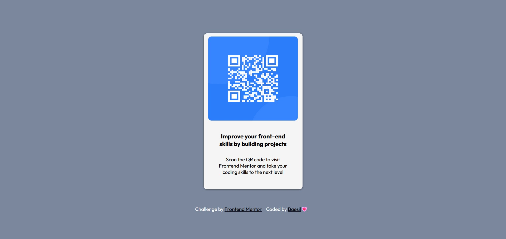
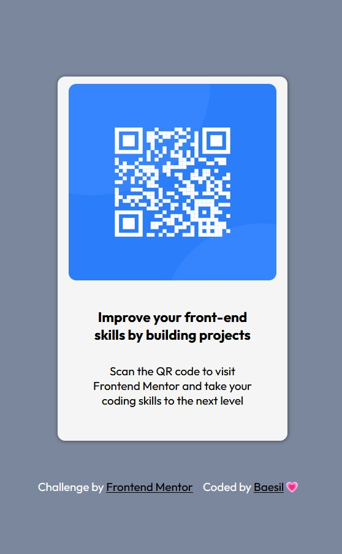

# Frontend Mentor - QR code component solution

This is a solution to the [QR code component challenge on Frontend Mentor](https://www.frontendmentor.io/challenges/qr-code-component-iux_sIO_H). Frontend Mentor challenges help you improve your coding skills by building realistic projects.

## Table of contents

- [Overview](#overview)
  - [Screenshot](#screenshot)S
  - [Links](#links)
- [My process](#my-process)
  - [Built with](#built-with)
- [Author](#author)
- [Acknowledgments](#acknowledgments)

## Overview

### Screenshot

### Links

- Solution URL: [Github](https://github.com/wandereskimo/QRcode-component)
- Live Site URL: [QRcode Component](https://qrcode-component-baesil.netlify.app/)

## My process

### Built with

- Semantic HTML5 markup
- CSS custom properties
- Flexbox

## Author

- Github - [Baesil](https://github.com/wandereskimo)
- Frontend Mentor - [@wandereskimo](https://www.frontendmentor.io/profile/wandereskimo)
- Twitter - [@baesils](https://twitter.com/BaesilS)

